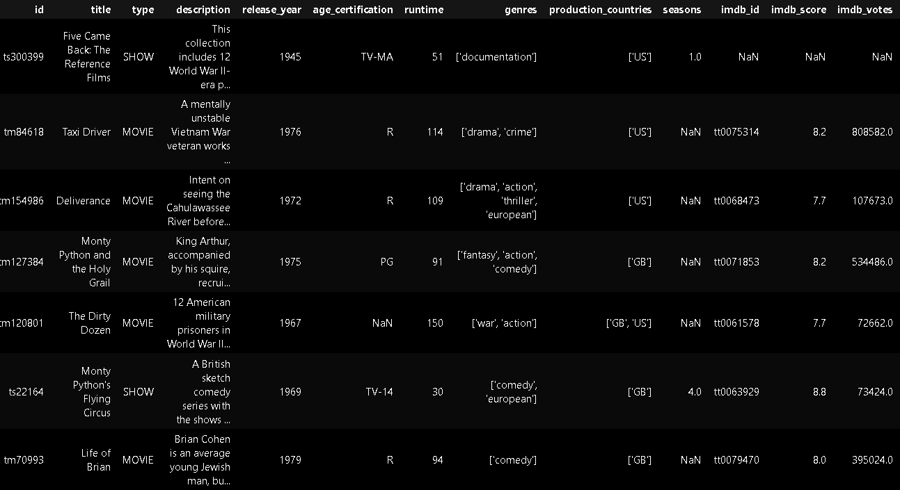
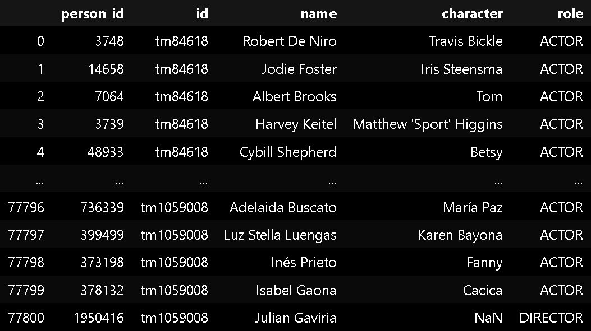

# Dashboard para busca dos filmes e séries da Netflix

Nossa visualização se propõe a oferecer ao leitor liberdade para explorar e analisar títulos presentes na Netflix de interesse, por meio de filtros e interações dinâmicas. A visualização não só permite que o usuário faça pesquisas dinâmicas dentro do catálogo da Netflix mas também faça análises das suas notas IMDb de acordo com o agrupamento criado pelos filtros. A visualização pode ser encontrada e experimentada no link: https://fgv-vis-2025.github.io/tarefa-4-netflix-trends/

Como fonte dos dados utilizamos o dataset [Netflix Movies and TV Shows](https://www.kaggle.com/datasets/victorsoeiro/netflix-tv-shows-and-movies), que encontramos no [Kaggle](https://www.kaggle.com/). No link encontramos 2 datasets. O primeiro é composto por mais de 5 mil títulos da Netflix, incluindo filmes e séries. E o segundo contém os atores e diretores que trabalharam em cada um dos filmes/séries. As principais colunas dos datasets são:

*Dataset com os filmes/series*

*Dataset com atores e diretores*

## Decisões de Design

Como nossa ideia era oferecer ao usuário liberdade para explorar os títulos da Netflix, decidimos criar um deshboard que serviria como uma plataforma de exploração para os usuários. Na prática temos um conjunto de gráficos em que o gráfico de dispersão é o principal, trazendo uma relação de Nota IMDb com o ano de lançamento onde cada ponto é um filme/série, e os gráficos de barras são auxiliares, servindo como filtros para aprofundar a possibilidade de análise do usuário. Vamos passar aqui pelas decisões que tivemos durante a construção da visualização.

### Codificações visuais
Optamos por utilizar gráficos de dispersão (scatter plot) para mapear as notas do IMDb ao longo do tempo (eixo X = ano de lançamento, eixo Y = nota do IMDb). Essa escolha permite visualizar possíveis tendências de qualidade percebida ao longo das décadas, além de destacar outliers. O gráfico "cru", sem a utilização dos filtros, a percepção de alguma tendência é dificultada pela presença de muitos pontos sobrepostos, há uma grande densidade de pontos que dificulta a análise indiviual de cada filme, mas reflete a predominância de filmes mais recentes na Netflix, bem como notas médias. Esse problema é contornado pelo uso dos filtros, mas ainda sim, sem eles, é possível observar os outliers.

Já nos gráficos auxiliares, optamos por gráficos de barras para representar histogramas, visto que já conhecido que são uma ótima forma de representação. Essa escolha também facilita posterior mente a interatividade com eles, de forma que basta o usuário clicar em uma barra para aplicá-lo a todos os outros gráficos. Nota-se que no histograma dos anos de lançamento tivemos que aplicar uma rotação de 45º nas labels dos ticks para facilitar a leiura.

### Interações
Nosso dashboard possui diversas interações. Começando pelo scatter plot, ao passar o mouse sobre um ponto ele tem uma mudança de cor para destaque e um tooltip aparece mostrando informações relevantes do filme em questão. Se clicar no ponto uma janela arrastável é aberta com ainda mais informações sobre o filme. Varias janelas podem ser abertas ao mesmo tempo e elas continuam até o usuário decidir fechá-las. A inteção por trás dessa implementação é que o usuário possa ir guardando as informações dos filmes que interessarem a ele.

Nos histogramas, ao passarmos o mouse sobre as barras também há uma mudança de cor e é mostrado um tooltip com informações de quantos filmes há na categoria. O mais interessante neles é clicar nas barras. Quando o clique é feito a barra é destacada com outra cor e o filtro é aplicado em todos os gráficos, de forma só os filmes que atendem a categoria marcada são considerados em todos os gráficos. É possível escolher multiplas barras ao mesmo tempo, fazendo filtros mais complexos que podem ser resultado de cliques em diversas barras entre os histogramas disponíveis. Esses filtros também podem ser combinados com os filtros de pesquisa.

Além dos gráficos há também filtros de pesquisa e caixas de marcação. Por meio desses campos o usuário pode filtrar todos os gráficos da forma que preferir. Os campos são nome do filme, onde o usuário pode pesquisar por palavras que aparecem nos títulos dos filmes, nome de ator, para filtrar por filmes em que o ator trabalha, e genero. Há também duas caixas para marcação que o usuário pode escolher se quer ver dados de filmes, séries ou ambos.

Por fim, há um botão que reseta todos os filtros.

### Design
Acreditamos que o uso do dashboard está intuitivo, mas por conta do número de gráficos em uma mesma visualziação, optamos por um design mais simples para não confundir o usuário, mas que ainda sim lembre a Netflix por meio da peleta de cores. Tentamos distribuir os gráficos de uma forma organizada que proveitasse bem a tela. 

## Decisões de Design

- Daniel de Miranda Almeida

- Luís Felipe de Abreu Marciano